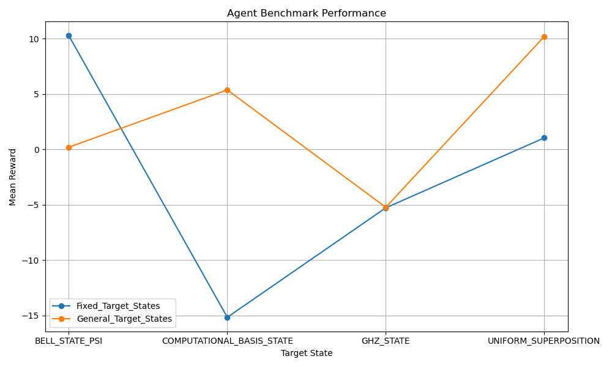

# Quantum State Preparation with Reinforcement Learning

This project implements a reinforcement learning (RL) framework for quantum state preparation using [Qiskit](https://qiskit.org/) and [Stable-Baselines3](https://stable-baselines3.readthedocs.io/). The goal is to train an agent to construct quantum circuits that prepare desired target states efficiently, under realistic hardware constraints.


## Features

- **Custom Gymnasium Environment**  
  `QuantumStatePreparation` simulates the process of preparing quantum states with a restricted gate set (H, CX, X, Z). Observations include Pauli expectations and meta information such as fidelity and remaining gates.

- **Target States**  
  - `TargetState`: Fixed small states (Bell states, GHZ, Ψ+, computational basis, uniform superposition).  
  - `GeneralTargetState`: Scalable families of states (GHZ(n), uniform superposition(n)).

- **Reinforcement Learning Agent**  
  The `QuantumnAgent` class manages training and evaluation using Maskable PPO from `sb3-contrib`. Supports both:
  - Standard training.
  - ALP-based curriculum learning via `ALPBandTeacher`.

- **Curriculum Learning**  
  Tasks are sampled dynamically based on Absolute Learning Progress (ALP). This balances training difficulty and accelerates convergence.

- **Benchmarking**  
  Benchmark module allows evaluation across both fixed and scalable target states, measuring fidelity, gate efficiency, and learning performance.


## Project Structure

```
libs/
├── agent.py                     # RL agent management (training, evaluation, inference)
├── alp.py                       # ALP-based curriculum teacher and wrapper
├── quantum_state_preparation.py # Custom Gymnasium environment
├── target_state.py              # Definitions for TargetState and GeneralTargetState
├── utils.py                     # Utility functions (e.g., log cleaning)
main.py                          # Code example
./run_qiskit.bat                 # To run the full pipeline
```

## Getting Started

### Installation

Clone the repository and install dependencies:

```
pip install -r requirements.txt
```

Recommended tools for managing dependencies:
- `pip freeze > requirements.txt` (all installed packages).
- `pipreqs ./ --force` (only required packages from imports).


### Training

Run training with a fixed set of target states:

```python
from libs.target_state import TargetState, TargetStateName
from libs.agent import QuantumnAgent

target_states = [
    TargetState(TargetStateName.BELL_STATE),
    TargetState(TargetStateName.GHZ_STATE),
]

agent = QuantumnAgent(
    model_folder_name="QSP_RL",
    target_states_list=target_states,
    total_timesteps=100000,
    eval_frequency=5000,
    eval_episode=20,
    training_mode=True
)
```

To use ALP-based curriculum learning:

```python
agent = QuantumnAgent(
    model_folder_name="QSP_RL_ALP",
    target_states_list=target_states,
    total_timesteps=100000,
    eval_frequency=5000,
    eval_episode=20,
    training_mode=True,
    use_alp=True
)
```

### Testing a Trained Model

```python
from libs.target_state import TargetState, TargetStateName
from libs.agent import QuantumnAgent

agent = QuantumnAgent(model_folder_name="QSP_RL", training_mode=False)
agent.build_circuit(TargetState(TargetStateName.BELL_STATE))
```

## Benchmarking

You can benchmark your trained models across suites of target states:

```python
from libs.target_state import TargetState, GeneralTargetState, TargetStateName
from libs.agent import QuantumnAgent
from libs.benchmark import Benchmark

agent = QuantumnAgent(model_folder_name="QSP_RL", training_mode=False)
bm = Benchmark(agent)

bm.add_suite("fixed", [
    TargetState(TargetStateName.BELL_STATE),
    TargetState(TargetStateName.GHZ_STATE),
])

bm.add_suite("scalable", [
    GeneralTargetState(TargetStateName.GHZ_STATE, num_qubits=4),
    GeneralTargetState(TargetStateName.UNIFORM_SUPERPOSITION, num_qubits=5),
])

results = bm.run_all(n_eval_episodes=20)
```

## Results

I benchmarked two training strategies:

- Fixed Target States: agent trained only on predefined fixed states.

- General Target States: agent trained on scalable, generalized states (e.g., GHZ with 2–4 qubits, uniform superposition with 2–4 qubits).



The agents were evaluated on a benchmark suite including GHZ(3), Uniform Superposition(3), Bell State (Ψ⁺), and Computational Basis State.

The General Model shows stronger performance on scalable families (GHZ, Uniform Superposition), indicating better generalization to multi-qubit structures.

The Fixed Model performs well on simple states (e.g., Bell State), but struggles with scalability.

For Computational Basis States, the General Model significantly outperforms the Fixed Model, highlighting the advantage of curriculum learning with Absolute Learning Progress (ALP).

So far, I can conclude that training with generalized states and ALP curriculum yields a more versatile model that adapts well to scalable quantum states, making it more suitable for larger quantum systems.

## Future Work

- Extend support for more quantum gates and hardware constraints.
- Add benchmarking for circuit depth and gate counts.
- Investigate transfer learning to larger systems.
- Explore multi-agent and hybrid quantum-classical approaches.

## License

This project is released under the MIT License.
